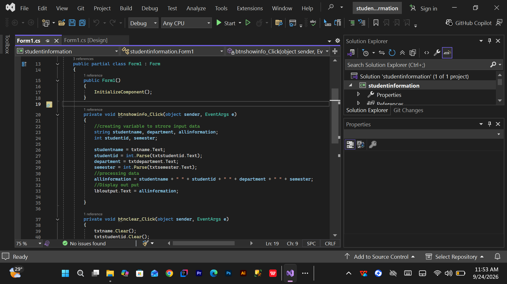

# Discourse Chapter 2

# Week 2 - C# Processing Data Practice

## Overview

This practice demonstrates how to:

* Create variables to store data
* Get data from input controls
* Convert input values into numbers
* Process data using arithmetic operators
* Store the calculated result in another variable
* Display the result using a Label control

---

## 1. Creating Variables

In this step, variables are created to store the data that will be processed.

For example, two integer variables can be used to store numbers, while another variable stores the result of the calculation.

The following code shows how the variables are declared in C#.

```csharp
int Number1, Number2, Result;
```

* `Number1` - stores the first number
* `Number2` - stores the second number
* `Result` - stores the result after processing the data

---

## 2. Getting Data from TextBox

In a Windows Forms application, users can enter data using a `TextBox`.

Because the `TextBox.Text` property returns a string, the value needs to be converted into an integer before performing mathematical calculations.

For example:

```csharp
Number1 = Convert.ToInt32(txtNumber1.Text);
Number2 = Convert.ToInt32(txtNumber2.Text);
```

This converts the values entered by the user into integer numbers.

---

## 3. Processing the Data

After receiving the input values, the data can be processed using arithmetic operators.

For example, two numbers can be added together using the `+` operator:

```csharp
Result = Number1 + Number2;
```

The result of the calculation is stored in the `Result` variable.

Other arithmetic operators can also be used:

```csharp
Result = Number1 - Number2;   // Subtraction
Result = Number1 * Number2;   // Multiplication
Result = Number1 / Number2;   // Division
```

---

## 4. Displaying the Result

After processing the data, the result can be displayed using a Label control.

The `.Text` property is used to display the value on the Windows Form.

```csharp
lblResult.Text = Result.ToString();
```

`ToString()` converts the integer result into a string so that it can be displayed by the Label.

---

## 5. Example Code

The following example shows a simple C# program that gets two numbers from TextBoxes, processes them, and displays the result.

```csharp
private void btnCalculate_Click(object sender, EventArgs e)
{
    int Number1, Number2, Result;

    Number1 = Convert.ToInt32(txtNumber1.Text);
    Number2 = Convert.ToInt32(txtNumber2.Text);

    Result = Number1 + Number2;

    lblResult.Text = Result.ToString();
}
```

---

## Conclusion

This practice demonstrates the basic process of handling and processing data in C#.

The main steps are:

1. Create variables.
2. Get data from the user.
3. Convert the input into the correct data type.
4. Process the data using operators.
5. Display the result using a Label control.


First Image (⁠one.png⁠):
This image shows code for displaying and formatting student information.  
 Event: ⁠btnshowinfo_Click⁠ (triggered when the "Show Info" button is clicked).  
 Functionality:
1. Declares variables for ⁠studentname⁠, ⁠department⁠, ⁠allinformation⁠ (strings), and ⁠studentid⁠, ⁠semester⁠ (integers).  
2. Assigns values to these variables by retrieving inputs from text boxes (⁠txtstudentname⁠, ⁠txtstudentid⁠, ⁠txtdepartment⁠, ⁠txtsemeter⁠), converting numeric fields using ⁠int.Parse()⁠.  
3. Concatenates all the variables into a single formatted string (⁠allinformation⁠).  
4. Displays the combined result in a label control (⁠lbloutput.Text⁠).  
Second Image (⁠image_67f5df.png⁠):
This image contains two event handlers responsible for clearing inputs and exiting the application:  
1. ⁠btnclear_Click⁠ (Clear Button):  
 Clears the text from all input fields (⁠txtstudentname⁠, ⁠txtstudentid⁠, ⁠txtdepartment⁠, ⁠txtsemeter⁠) using the ⁠.Clear()⁠ method.  
 Resets/clears the result label (⁠lbloutput.Text = " "⁠).  
2. ⁠btnexit_Click⁠ (Exit Button):  
 Closes the active form/window using ⁠this.Close()
 