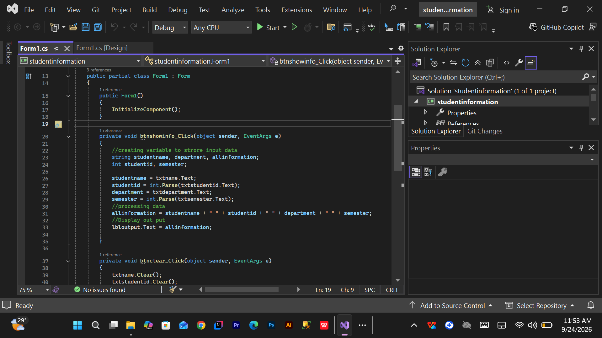

# Discourse Chapter 2
## 1. Creating Variables

In this step, variables are created to store the data that will be processed.

For example, two integer variables can be used to store numbers, while another variable stores the result of the calculation.

The following code shows how the variables are declared in C#.
1. Create variables.
2. Get data from the user.
3. Convert the input into the correct data type.
4. Process the data using operators.
5. Display the result using a Label control.

First Image (⁠one.png⁠):
This image shows code for displaying and formatting student information.  
 Event: ⁠btnshowinfo_Click⁠ (triggered when the "Show Info" button is clicked).  
 Functionality:
1. Declares variables for ⁠studentname⁠, ⁠department⁠, ⁠allinformation⁠ (strings), and ⁠studentid⁠, ⁠semester⁠ (integers).  
2. Assigns values to these variables by retrieving inputs from text boxes (⁠txtstudentname⁠, ⁠txtstudentid⁠, ⁠txtdepartment⁠, ⁠txtsemeter⁠), converting numeric fields using ⁠int.Parse()⁠.  
3. Concatenates all the variables into a single formatted string (⁠allinformation⁠).  
4. Displays the combined result in a label control (⁠lbloutput.Text⁠).  
Second Image (⁠image_67f5df.png⁠):
This image contains two event handlers responsible for clearing inputs and exiting the application:  
1. ⁠btnclear_Click⁠ (Clear Button):  
 Clears the text from all input fields (⁠txtstudentname⁠, ⁠txtstudentid⁠, ⁠txtdepartment⁠, ⁠txtsemeter⁠) using the ⁠.Clear()⁠ method.  
 Resets/clears the result label (⁠lbloutput.Text = " "⁠).  
2. ⁠btnexit_Click⁠ (Exit Button):  
 Closes the active form/window using ⁠this.Close()
 